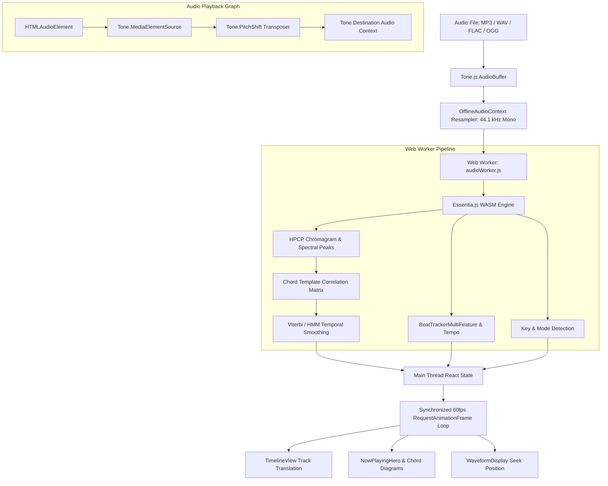

<div align="center">

# 🎵 Cadence

### Chord Recognition, Key Detection & Real-Time Playback Studio

[](https://nextjs.org/)
[](https://react.dev/)
[](https://tonejs.github.io/)
[](https://mtg.github.io/essentia.js/)
[](LICENSE)

<p align="center">
  <b>Cadence</b> is a client-side digital signal processing (DSP) workstation for musicians, producers, and educators. Upload any audio file to instantly extract harmonic progressions, estimate musical key and tempo, and practice with real-time synchronized guitar voicings, interactive transposition, and looping.
</p>

</div>

---

## ✨ Features

- **⚡ Client-Side Audio Pipeline**: 100% private, zero-backend processing. Audio decoding, resampling, and DSP feature extraction run entirely in the browser using WebAssembly and Web Workers.
- **🎼 Harmonic Analysis Pipeline**:
  - Harmonic Pitch Class Profile (HPCP) chromagram extraction.
  - Viterbi path decoding / Hidden Markov Model (HMM) smoothing for musically coherent chord transitions.
  - Key signature estimation with Krumhansl-Schmuckler profiles and confidence metrics.
  - Beat tracking, dynamic BPM calculation, and time signature estimation.
- **🎸 Smart Fretboard Voicings & Capo Engine**:
  - Interactive SVG guitar chord diagrams with fingerings, open strings, and barre markers.
  - **3 Voicing Modes**:
    - `Easy`: Simplifies to open chords with an **automatic optimal capo calculator**.
    - `Intermediate`: Clean triad structures.
    - `Hard`: Extended voicings (7ths, 9ths, sus2/sus4, dim, aug).
- **⏱️ Hardware-Accelerated 60fps Timeline**:
  - Sub-frame playhead synchronization with beat indicators and upcoming chord lookahead countdowns.
  - Interactive clickable chord blocks for instant scrubbing.
- **📄 Dual View Modes**:
  - **Progression Timeline**: Continuous scrolling horizontal chord track with live guitar chart hero.
  - **Chord Sheet View**: Traditional measure-aligned chord charts with beat rhythm markers.
- **🎛️ Practice Studio Controls**:
  - **Live Semitone Transposition**: Real-time pitch shifting powered by Tone.js without altering playback speed.
  - **Tempo Scaling**: Slow down (0.25x) or speed up (2.0x) with native pitch preservation.
  - **A/B Section Looping**: Loop verses, choruses, or custom ranges for focused instrument rehearsal.
- **🌊 Interactive Waveform & Visualizer**:
  - High-resolution amplitude waveform with colored song section boundaries and seeking.
  - Rhythmic metronome visualizer synchronized to detected beat grids.

---

## 🏗️ Architecture & Audio Pipeline



---

## 📁 Repository Structure

```text
├── public/
│   ├── essentia-wasm.web.wasm   # Essentia WebAssembly DSP binary
│   └── songs/                   # Built-in sample benchmark audio tracks
├── src/
│   ├── app/
│   │   ├── globals.css          # Design system, theme tokens, and glassmorphism styling
│   │   ├── layout.js            # App shell with OpenGraph metadata and font configuration
│   │   └── page.js              # Main studio controller and audio state orchestrator
│   ├── components/
│   │   ├── AnalysisBadges.js    # Key, BPM, meter, and unique chord count badges
│   │   ├── ChordChart.js        # High-res SVG guitar chord diagrams and voicings
│   │   ├── ChordSheetView.js    # Measure-aligned chord sheet grid
│   │   ├── Header.js            # App branding header
│   │   ├── NowPlayingHero.js    # Live chord card with beat pulse and upcoming preview
│   │   ├── PlayerControls.js    # Transport buttons, waveform scrubbing, and time readouts
│   │   ├── SectionMarkers.js    # Song structure pills and loop controls
│   │   ├── SettingsBar.js       # Transpose, voicing difficulty, and playback speed controls
│   │   ├── TimelineView.js      # 60fps horizontal scrolling timeline track
│   │   ├── UploadZone.js        # Drag-and-drop zone and quick sample song loaders
│   │   ├── Visualizer.js        # Audio metronome beat indicator
│   │   └── WaveformDisplay.js   # Interactive waveform seeking and section overlay
│   └── lib/
│       ├── audioWorker.js       # Dedicated Web Worker running Essentia WASM DSP algorithms
│       ├── benchmarkSongs.js    # Metadata for benchmark audio tracks
│       └── chordTemplates.js   # Harmonic chroma templates for major, minor, 7th, and sus chords
├── scripts/                     # Automated accuracy evaluation & benchmark runners
├── package.json
└── next.config.mjs              # Webpack WASM polyfill configuration
```

---

## 🚀 Getting Started

### Prerequisites

- [Node.js](https://nodejs.org/) (v18.17.0 or newer recommended)
- `npm`, `pnpm`, or `yarn`

### Installation

1. Clone the repository:
   ```bash
   git clone https://github.com/your-username/cadence.git
   cd cadence
   ```

2. Install dependencies:
   ```bash
   npm install
   ```

3. Launch the development server:
   ```bash
   npm run dev
   ```

4. Open [http://localhost:3000](http://localhost:3000) in your web browser.

---

## 🧪 Testing & Benchmarks

Cadence includes offline benchmark suites to evaluate chord recognition against ground-truth datasets across various genres:

```bash
# Run chord detection benchmarks on sample library
node scripts/run_benchmark.js
```

---

## 🛠️ Built With

| Layer | Technologies |
| :--- | :--- |
| **Framework** | [Next.js 16](https://nextjs.org/) (App Router, React 19) |
| **Audio Processing** | [Tone.js](https://tonejs.github.io/), [Web Audio API](https://developer.mozilla.org/en-US/docs/Web/API/Web_Audio_API) |
| **Audio DSP & MIR** | [Essentia.js](https://mtg.github.io/essentia.js/) (WASM / C++ port), Web Workers |
| **Music Theory** | [Tonal](https://github.com/tonaljs/tonal) |
| **Icons & Styling** | [Lucide React](https://lucide.dev/), Modern Vanilla CSS Design System |

---

## 📄 License

This project is licensed under the MIT License — see the [LICENSE](LICENSE) file for details.
